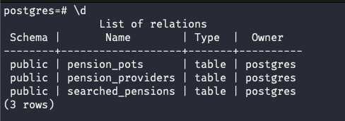
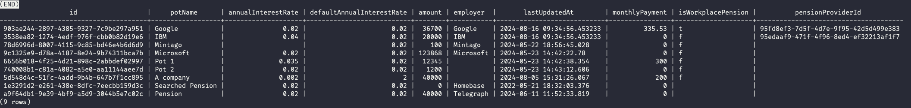
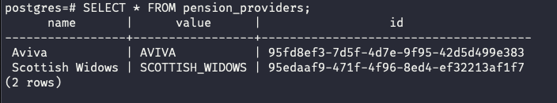
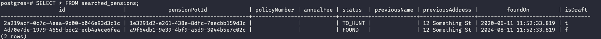

# Pension Pots API 

## Instructions

1. **start postgres in docker container**
```
docker-compose up
```
2. **run app**
```
npm start
```
3. **seed db**
```
npm run seed
```

## Plan 

1. Setup postgres with docker for local development 
2. Setup project using typeorm starter script
3. spilt data into three tables `pension_pots`, `pension_providers`, `searched_pension` to reduce redundency 
4. populate db
5. build out endpoints
    1. `/pension-pots `
    2. `/searched-pensions`
    3. `/pots`
    4. `/pots/search?potName=Google`
    5. `/pots/search?id=:id`
    6. `/pots/search/:value?greaterThan=:number`
    7. `/pots/search/:value?lessThan=:number`
    8. `/searched-pensions/found`
    9. `/pots/search?employer=:employer`
    10. `/pots/search?pensionProvider=:pensionProvider.name`
    11. `/pots?forecast=true&years=10`
6. write acceptatance tests for each endpoint 

### Technology 
- nodejs
- TypeScript
- Express.js 
- Vitest
- PostgreSQL
- Docker 

## DB structure

## Tables


## Pension Pot table


## Pension provider


## Searched pensions


## Tradeoffs

- **Typeorm starter** - Choose to use typeorm because I have recently inherited a project at work that uses it and wanted to build something from scratch to improve my understanding of it (🦆🦜🗿). I decided to use the starter script `typeorm init --database postgres --express` owing to time limitations. It got me up and running quickly but dependencies where a little outdated along with the TypeScript config, and the project structure was lacking. With more time, I'd prefer to modify the config and structure or set up the project from scratch. Also Typeorm itself didn't play nicely with the test setup I used to so stopped me from getting going with that.

- **testing** - plan was to write integration tests that would hit each endpoint - with varying params (if applicable) however I got stuck on a `ColumnTypeUndefinedError` and after spending some time trying to fix it, I thought it was more valuable to get the functionality working first. 


## Whats next? 
- fix and write more tests
- extract repetative code in reusable utils - e.g. `flattenSearchedPensions`
- For the search endpoint on each search update the `searched_pensions` table with the details of the pension pot that was searched for. 
- remove extraineous data from response e.g. `searchedPensions` or `id` on pension providers
- more tests for `calculateFutureValue` - happy path as well for with no values. 
- setup `docker-compose` to run the app as well


